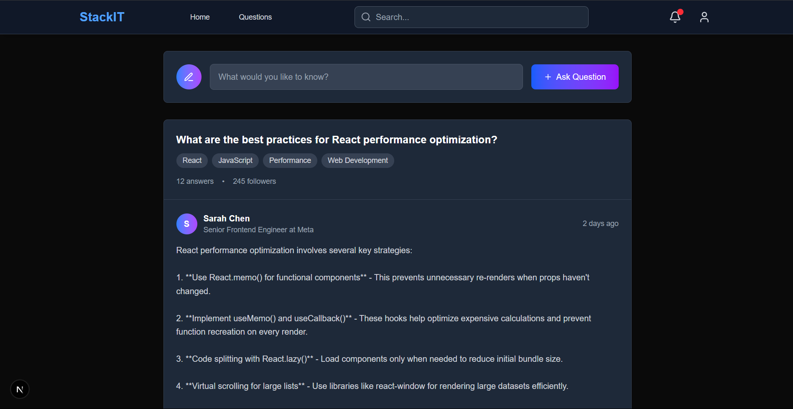
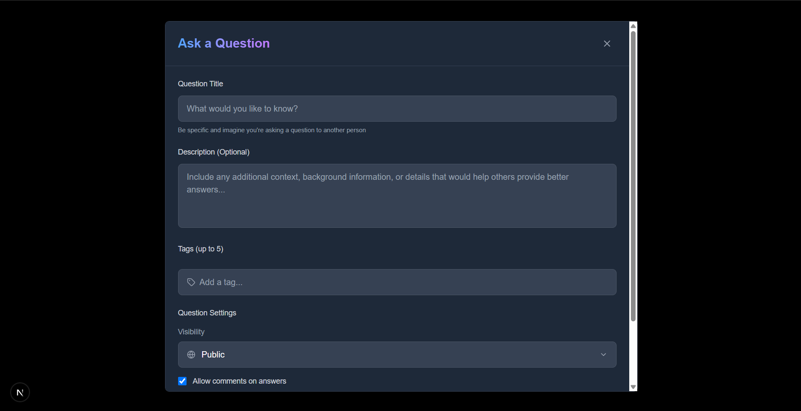

# StackIt Client (Next.js) README

Welcome to the **StackIt** frontend! This README will guide you through setting up, running, and understanding the client-side of our minimal Q\&A platform.

---

## 📦 Tech Stack

* **Next.js** (React framework with SSR & SSG)
* **React Query** for data fetching and caching
* **Tailwind CSS** for utility-first styling
* **TipTap** as our rich text editor
* **Headless UI** for accessible UI components
* **JWT** (JSON Web Token) for authentication flows

---

## 🚀 Getting Started

1. **Clone the repository**

   ```bash
   git clone https://github.com/your-org/stackit-client.git
   cd stackit-client
   ```

2. **Install dependencies**

   ```bash
   npm install
   # or
   yarn install
   ```

3. **Configure environment variables**
   Create a `.env.local` at project root:

   ```env
   NEXT_PUBLIC_API_URL=http://localhost:8000/api
   ```

4. **Run in development mode**

   ```bash
   npm run dev
   # or
   yarn dev
   ```

   Open [http://localhost:3000](http://localhost:3000) to view in the browser.

5. **Build & start production**

   ```bash
   npm run build
   npm start
   ```

---

## 🗂️ Project Structure

```text
stackit-client/
├── components/       # Reusable UI components
├── context/          # React Query & Auth Providers
├── hooks/            # Custom React hooks
├── pages/            # Next.js page routes
│   ├── _app.js       # App wrapper
│   ├── index.js      # Home page (question feed)
│   └── auth/         # Login, Register pages
├── public/           # Static files (images, fonts)
├── styles/           # Tailwind config & globals
└── utils/            # Helper functions (API client, formatters)
```

---

## ✨ Features

* **Authentication**: Register, Login, JWT token handling
* **Ask Questions**: Title, rich text description, tags
* **Answer & Comment**: Full rich editor support
* **Voting**: Upvote/downvote answers
* **Real-Time Notifications**: Live updates via WebSockets
* **User Profile**: View your activity and stats

---

## 📸 Screenshots

### Home / Question Feed


*View and filter the latest questions.*

### Ask Question Form


*Create a new question with rich text and tags.*

---

## 🛠️ Scripts

| Command  | Description                          |
| -------- | ------------------------------------ |
| `dev`    | Run Next.js in development mode      |
| `build`  | Build the application for production |
| `start`  | Start the production server          |
| `lint`   | Run ESLint to analyze code quality   |
| `format` | Format code with Prettier            |

---

## 🤝 Contributing

1. Fork the repo
2. Create a feature branch
3. Commit your changes
4. Open a Pull Request

Please follow our [Code of Conduct](CODE_OF_CONDUCT.md) and report any issues via the [issue tracker](https://github.com/your-org/stackit-client/issues).

---

## 📄 License

This project is licensed under the MIT License. See [LICENSE](LICENSE) for details.
